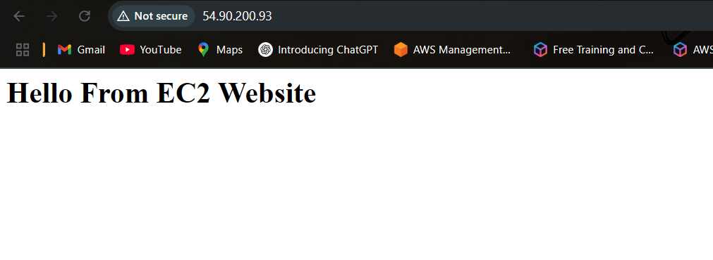

# 🚀 Project: Static Website Hosting on AWS EC2

## 📌 Description
A beginner-friendly cloud project to host a static HTML website on an AWS EC2 instance using Apache web server. Demonstrates core AWS concepts such as EC2, security groups, and Linux server management.

## 🛠️ Tech Stack
- AWS EC2 (Amazon Linux)
- Apache Web Server
- HTML/CSS
- Security Groups
- SSH

## 📂 Setup Steps

1. **Launch EC2 Instance**
   - Amazon Linux 2, t2.micro (free tier)
   - Open ports: 22, 80
   - Use Key Pair for SSH

2. **Connect to Instance**
   ```bash
   ssh -i "your-key.pem" ec2-user@your-public-ip

   ## 📸 Screenshot


